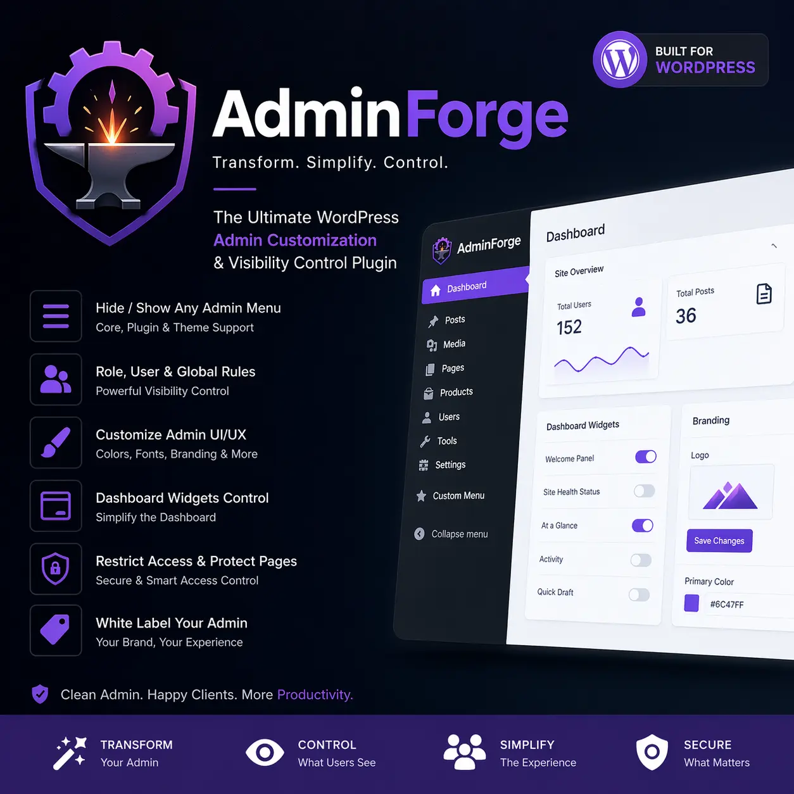

# AdminForge

Created by Abe Prangishvili.

AdminForge is a professional WordPress admin transformation plugin for simplifying, white-labeling, and controlling the backend experience by role, user, or globally.



## Overview

AdminForge helps you turn WordPress into a cleaner, client-ready admin experience without hacking core files.

It is designed for:

- agencies
- client portals
- white-label dashboards
- role-based admin simplification
- plugin menu visibility control

## Core Features

- Dynamic scanning of registered admin menu and submenu items
- Menu visibility rules for:
  - WordPress core
  - themes
  - plugins such as Elementor, JetEngine, and JetSmartFilters
- Scope targeting for:
  - all users
  - selected roles
  - selected users
- Role priority and user priority logic
- Dashboard widget visibility control
- Direct URL access restriction for hidden admin pages
- Admin UI customization foundation
- White-label branding controls
- Custom admin CSS and JS support
- AJAX helpers for menu rescanning and user search

## Plugin Metadata

- Plugin Name: AdminForge
- Plugin Slug: adminforge
- Text Domain: adminforge
- Author: Abe Prangishvili
- Version: 1.0.6

## Folder Structure

```text
adminforge.php
admin/
includes/
modules/
assets/
languages/
```

## Installation

1. Upload the `adminforge` plugin folder to `/wp-content/plugins/`.
2. Activate the plugin in WordPress.
3. Go to `AdminForge` in the WordPress admin menu.
4. Rescan menus and configure visibility rules, branding, and UI options.

## How It Works

AdminForge scans the current admin menu tree and stores a structured inventory of top-level items, submenu items, and dashboard widgets.

Rules can be applied at three levels:

1. Global defaults
2. Role-based targeting
3. User-based targeting

User-specific rules take priority over role rules, and role rules take priority over global defaults.

## Usage Notes

- Use `Hide selected menu items` to remove clutter from the admin sidebar.
- Use `Show only selected menu items` to create a minimal backend surface.
- Enable direct-access restrictions to prevent hidden pages from being opened manually by URL.
- Use the branding controls to create a more client-friendly admin experience.

## Security

AdminForge uses:

- capability checks
- nonce verification
- sanitization and escaping
- safe redirects
- defensive access blocking

## Roadmap

Planned premium-ready expansions include:

- import/export
- presets
- multisite support
- per-screen customization
- drag-and-drop admin layouts
- analytics
- custom dashboard widgets
- onboarding panels

## Changelog

### 1.0.6 - 2026-04-28

- Fixed DOM-safe rendering for AJAX user selector results to prevent admin-page XSS from user display names.
- Restricted menu and dashboard inventory writes to users with AdminForge management capability.
- Made the AJAX helper setting enforceable at hook and endpoint level.
- Hardened redirect target validation for direct-access restriction responses.
- Tightened CSS value validation and limited raw custom CSS/JS saving to users with `unfiltered_html`.
- Escaped login logo URLs at output time.

## License

GPL-2.0-or-later
